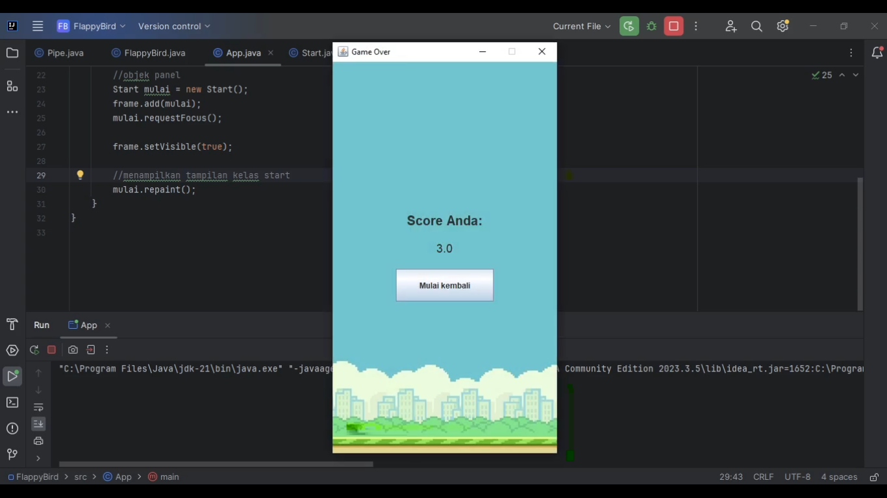

### LP7DPBO2024C2
Saya Nabilla Assyfa Ramadhani [2205297] mengerjakan LP7 dalam mata Desain dan Pemograman Berorientasi Objek untuk keberkahanNya maka saya tidak melakukan kecurangan seperti yang telah dispesifikasikan. Aamiin

# Desain Program
Program ini menggunakan 6 buah kelas, yang terdiri dari :
1. **Main Class (`App.java`)** : Kelas utama yang digunakan untuk membuat jendela GUI permainan Flappy Bird dan menampilkan kelas `Start` untuk memulai permainan.
2. **Tampilan awal (`Start.java`)** : Kelas tersebut digunakan untuk membuat tampilan awal permainan Flappy Bird dan memulai permainan saat pengguna menekan tombol "mulai".
3. **Game Class (`FlappyBird.java`)** : Kelas ini digunakan untuk menampung metode pada permainan. Adapun metode nya antara lain :  
    - **Konstruktor `FlappyBird`()** : Digunakan untuk inisialisasi permain, mengatur frame, memuat gambar dan objek permainan, dan memulai timer untuk pergerakan burung dan membuat pipa.
    - **Metode `Move`** : Digunakan untuk menangani pergerakan burung dan pipa, serta mendeteksi tabrakan antara burung dan pipa.
    - **Metode `GameOver`** : Digunakan untuk menampilkan frame "Game Over" ketika permainan berakhir.
    - **Metode `Collision`** : Digunakan untuk mendeteksi tabrakan antara burung dan pipa.
    - **Implementasi `KeyListener`**: Digunakan untuk menanganai input pengguna untuk menggerakan burung keatas dengan menekan tombol "Spasi" pada keyboard.
4. **Player Class (`Player.java`)** : Kelas ini digunakan untuk mengelola atribut dan perilaku burung dalam permainan, seperti posisi, ukuran, dan pergerakan. 
5. **Pipe Class (`Pipe. java`)** : Kelas ini digunakan untuk merepresentasikan pipa dalam permainan Flappy Bird.
6. **GameOver Class (`GameOver.java`)** : Kelas ini digunakan untuk menampilkan frame saat permainan berakhir, serta menampilkan skor yang didapatkan oleh user. Kelas ini juga mengimplementasikan `KeyListener` untuk menangani input pengguna untuk memulai permainan baru dengan menekan tombol "R" pada keyboard.

# Penjelasan Alur Program
1. Ketika user menekan tombol mulai, frame permainan Flappy Bird akan ditampilkan.
2. Untuk membuat burung terbang lebih tinggi, user harus menekan tombol spasi pada keyboard.
3. User harus melewati setiap pipa untuk mendapatkan 1 poin. Jika burung jatuh atau menabrak pipa, permainan akan berakhir.
4. Setelah permainan berakhir, akan muncul frame "Game Over" yang menampilkan skor yang diperoleh oleh user.
5. User dapat menekan tombol "R" atau tombol mulai untuk memulai kembali permainan.

# Dokumentasi Program

#### Tampilan layar pertama

#### Tampilan saat game dimainkan

#### Tampilan saat game berakhir

